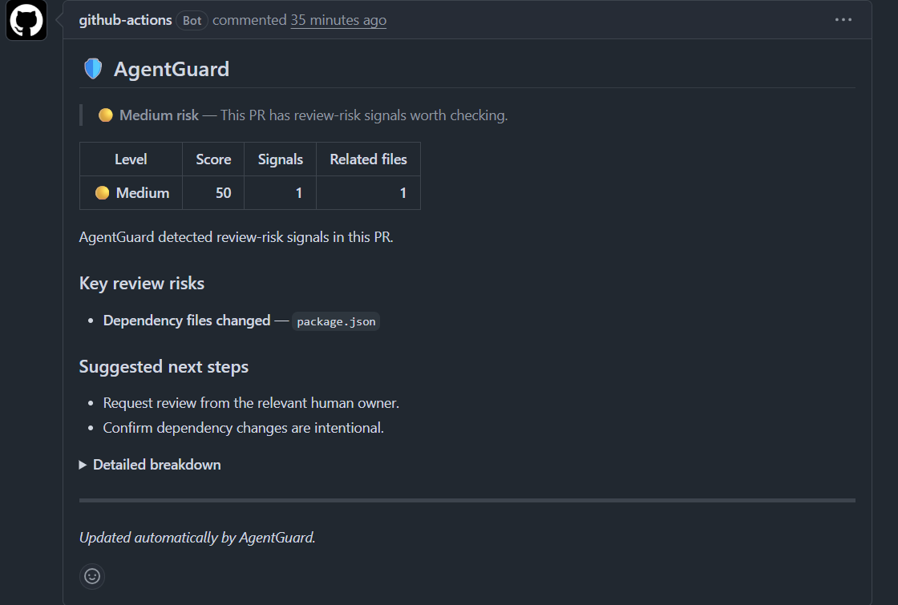

# AgentGuard

Let agents code. Know which PRs need human attention.

> **Public beta:** AgentGuard is currently in public beta. Defaults, docs, and APIs may change before v1.0.

AgentGuard is a lightweight GitHub Action that flags risky AI-generated or bot-created pull requests before they are merged.

It answers one narrow question:

> Does this AI/bot-created pull request deserve extra human attention?

AgentGuard is intentionally small and deterministic.

AgentGuard has:

- no backend
- no database
- no AI calls
- no telemetry
- no dashboard
- no source code leaving GitHub Actions
- deterministic risk rules
- language-aware file-pattern detection, not language parsing
- high/critical-only PR comments by default
- non-blocking behavior by default

AgentGuard does not prove code is safe or correct. It does not replace human reviewers. It does not perform AI code review or security scanning.

## Screenshot



The PR comment is designed to be compact, actionable, and clear: verdict first, key review risks next, detailed breakdown collapsed below.

## How it works

```text
AI/Bot Pull Request
→ GitHub Action Runs
→ Changed Files Analyzed
→ Deterministic Risk Rules Applied
→ Workflow Summary Written
→ Optional PR Comment Posted
→ Human Reviewer Decides
```

By default, AgentGuard runs in `ai-only` mode and posts PR comments only when risk is `high` or `critical`.

Low and medium risk PRs write a GitHub Actions workflow summary only.

## Install

Create `.github/workflows/agentguard.yml`:

```yaml
name: AgentGuard

on:
  pull_request:
    types: [opened, synchronize, reopened, ready_for_review]

permissions:
  contents: read
  pull-requests: write
  issues: write

jobs:
  agentguard:
    runs-on: ubuntu-latest
    steps:
      - uses: actions/checkout@v4

      - uses: andreas131989/agentguard-action@v0.1.0
        with:
          mode: ai-only
          comment-threshold: high
```

## Required permissions

```yaml
permissions:
  contents: read
  pull-requests: write
  issues: write
```

Why these permissions are needed:

| Permission | Reason |
| --- | --- |
| `contents: read` | Allows checkout and config file access |
| `pull-requests: write` | Allows AgentGuard to read pull request metadata and changed file metadata |
| `issues: write` | Allows AgentGuard to create or update one PR comment |

GitHub PR comments use the Issues comments API, so `issues: write` is required for commenting.

## Comment behavior

AgentGuard always writes a GitHub Actions workflow summary.

By default:

| Risk level | Workflow summary | PR comment |
| --- | --- | --- |
| low | Yes | No |
| medium | Yes | No |
| high | Yes | Yes |
| critical | Yes | Yes |

AgentGuard updates one existing comment using this hidden marker:

```md
<!-- agentguard-risk-report -->
```

Repeated workflow runs update the existing AgentGuard comment instead of creating duplicates.

## Inputs

```yaml
with:
  github-token: ${{ github.token }}
  config-path: .agentguard.yml
  mode: ai-only
  comment-threshold: high
```

| Input | Required | Default | Description |
| --- | --- | --- | --- |
| `github-token` | No | `${{ github.token }}` | Token used for GitHub API calls |
| `config-path` | No | `.agentguard.yml` | Optional config file path |
| `mode` | No | `ai-only` | When AgentGuard should run |
| `comment-threshold` | No | `high` | Risk level required before AgentGuard comments |
| `license-key` | No | Empty | Reserved for future commercial beta usage |

## Modes

### `ai-only`

Default. Analyze PRs that appear AI/bot-authored.

```yaml
with:
  mode: ai-only
```

Human PRs are skipped quietly in this mode.

### `labeled`

Analyze PRs with AI/bot labels.

```yaml
with:
  mode: labeled
```

Common labels include:

- `ai-generated`
- `agent-pr`
- `bot`
- `cursor`
- `copilot`
- `codex`
- `claude-code`
- `devin`

### `all-prs`

Analyze every PR.

```yaml
with:
  mode: all-prs
```

This is useful for evaluation, but it can be noisier than `ai-only`.

## Optional config

AgentGuard works without config.

Optional `.agentguard.yml`:

```yaml
enabled: true
mode: ai-only
comment_threshold: high

agent_authors:
  - "github-copilot[bot]"
  - "cursor-agent"
  - "devin-ai"
  - "codex-agent"
  - "claude-code"

critical_paths:
  - "auth/**"
  - "billing/**"
  - "payments/**"
  - "infra/**"
  - "migrations/**"
  - ".github/workflows/**"

ignore_paths:
  - "docs/**"
  - "*.md"
  - "generated/**"
  - "dist/**"
```

## Risk signals

AgentGuard currently detects:

- AI/bot PR metadata
- sensitive paths changed
- dependency files changed
- migration/schema/API schema files changed
- CI/CD/deployment files changed
- source changed without tests
- large PRs
- obvious secrets/env/credential-like files
- many unrelated top-level directories

AgentGuard uses language-aware file-pattern detection, not language parsing.

## Language and ecosystem support

AgentGuard works with any GitHub repository and includes default risk patterns for:

- JavaScript / TypeScript
- Python
- Go
- Rust
- Ruby
- Java / Kotlin
- PHP
- .NET
- SQL / schema files
- Terraform / infra
- Docker
- GitHub Actions / CI

This is file-pattern support, not semantic code understanding.

## Privacy

AgentGuard:

- runs inside GitHub Actions
- does not use a hosted backend
- does not use a database
- does not call AI models
- does not send telemetry
- does not send source code to AgentGuard servers
- does not store customer repository data

AgentGuard uses GitHub’s API inside the workflow to read pull request metadata, fetch changed file metadata, list PR comments, and create or update one PR comment when needed.

## Limitations

AgentGuard does not:

- prove code is safe
- prove code is correct
- perform security scanning
- perform AI code review
- understand code semantically
- parse ASTs
- block merges by default
- replace human reviewers
- inspect file contents
- skip binary files based on binary content

AgentGuard classifies changed files by path metadata and PR metadata.

## Public beta status

AgentGuard is currently in public beta.

Expected during public beta:

- defaults may be adjusted
- docs may change
- risk scoring may be recalibrated
- config surface may change before v1.0

## Commercial beta

Interested in using AgentGuard for private or commercial repositories?

Contact:

```text
andreas131989@users.noreply.github.com
```

No license server, billing system, telemetry, or hosted validation exists in the public beta.

## Local development

```bash
npm install
npm run test
npm run typecheck
npm run lint
npm run build
```

The action metadata points to:

```text
dist/index.cjs
```

Before publishing or testing with `uses: ./`, run:

```bash
npm run build
```